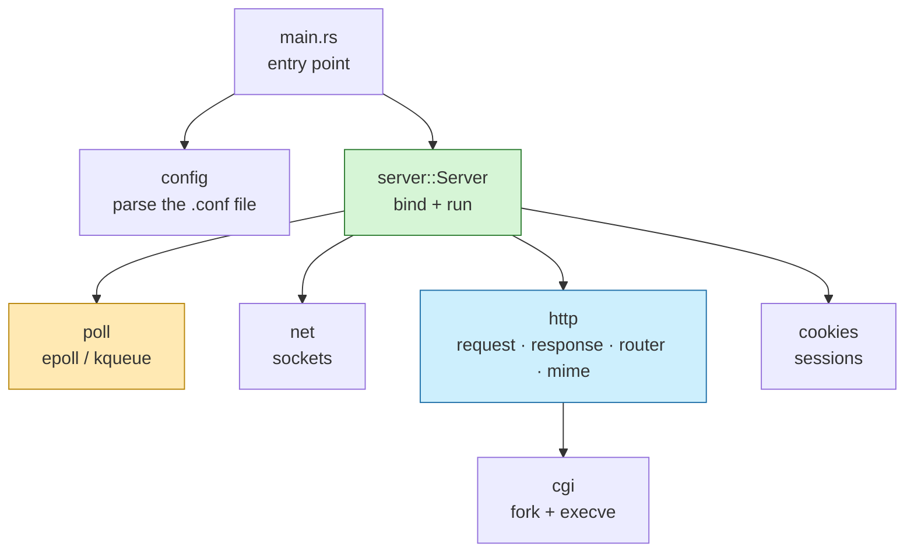
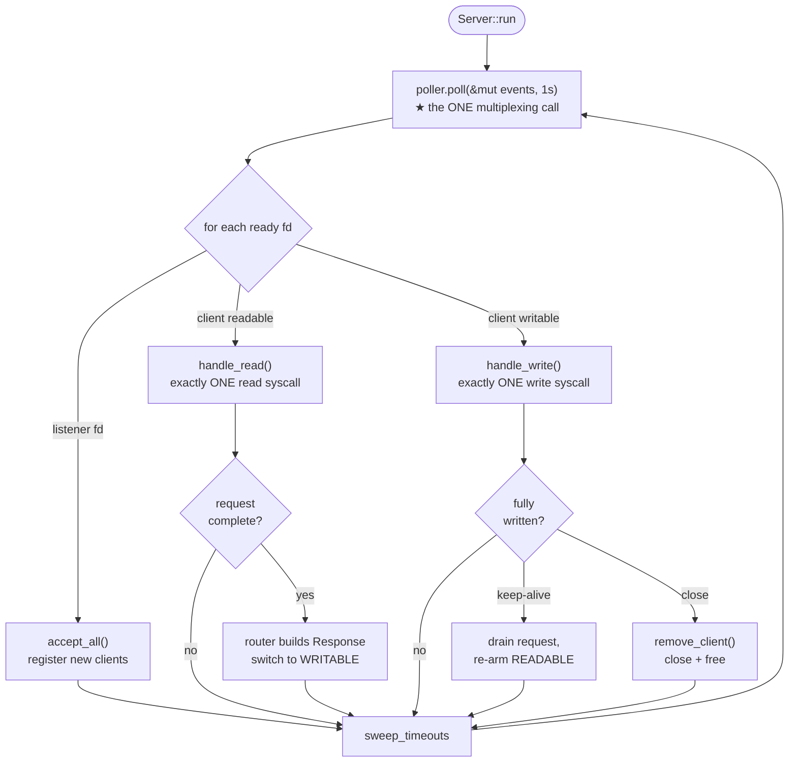
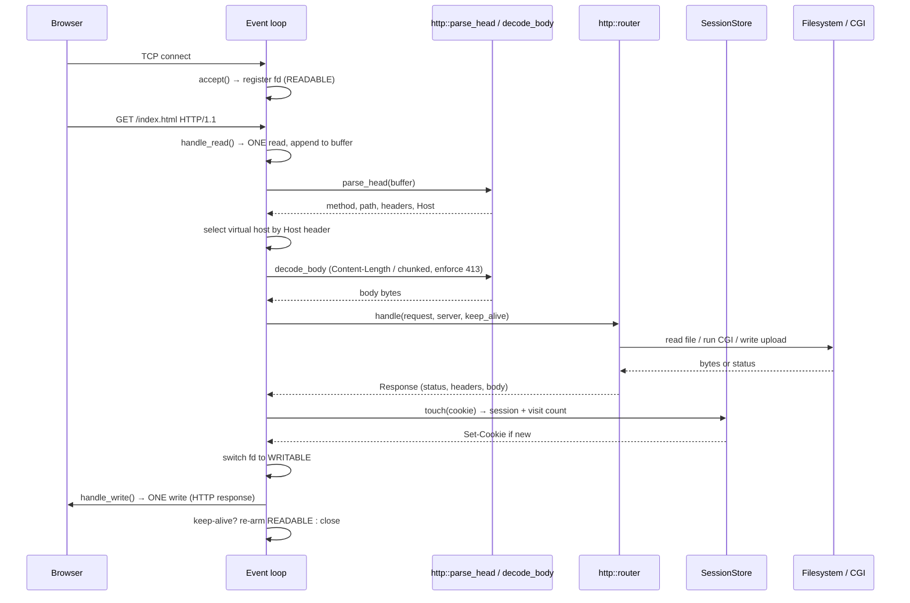
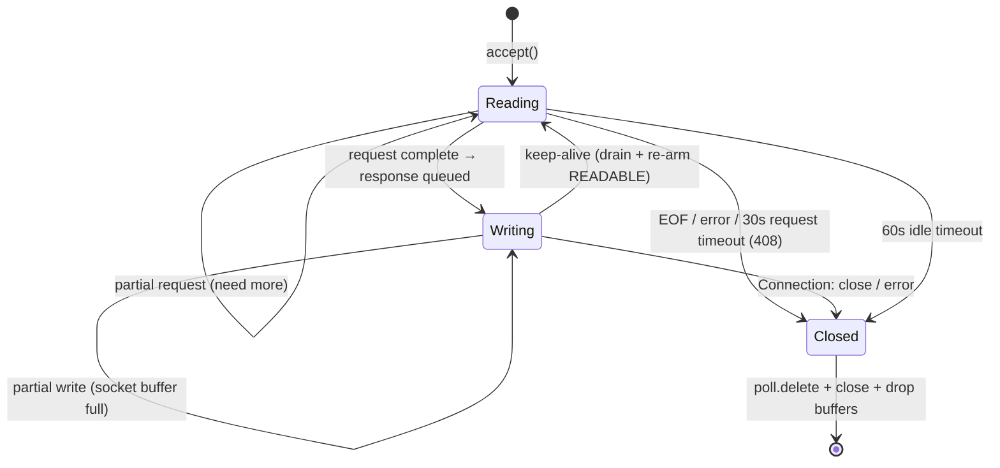
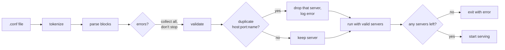
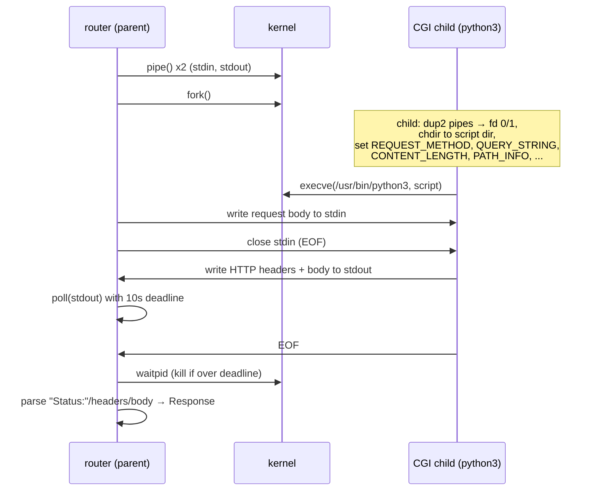
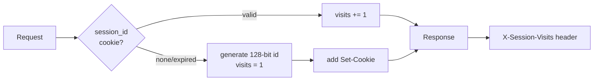

# Localhost — a from-scratch HTTP/1.1 server in Rust

A single-process, single-threaded **HTTP/1.1 web server** written in Rust using
only the `libc` crate for system calls. No `tokio`, no `nix`, no web framework —
the socket handling, event loop, HTTP parsing, CGI, sessions, and config parser
are all hand-written.

> **In one sentence:** it does what NGINX does at a small scale — serves files,
> handles uploads, runs CGI scripts, manages cookies — but every byte of it is
> code you can read and explain.

---

## Table of contents

1. [For the impatient (quick start)](#for-the-impatient-quick-start)
2. [What is an HTTP server? (plain language)](#what-is-an-http-server-plain-language)
3. [Architecture at a glance](#architecture-at-a-glance)
4. [The single event loop (the heart)](#the-single-event-loop-the-heart)
5. [How one request flows through the server](#how-one-request-flows-through-the-server)
6. [A connection's life (state machine)](#a-connections-life-state-machine)
7. [Module-by-module reference](#module-by-module-reference)
8. [Configuration file reference](#configuration-file-reference)
9. [Features & supported behavior](#features--supported-behavior)
10. [CGI execution explained](#cgi-execution-explained)
11. [Cookies & sessions](#cookies--sessions)
12. [Project layout](#project-layout)
13. [Testing & verification](#testing--verification)
14. [Design decisions & limitations](#design-decisions--limitations)
15. [Further docs](#further-docs)

---

## For the impatient (quick start)

```bash
cd lc
cargo build --release
./target/release/localhost config/default.conf
# then open http://127.0.0.1:8080/ in a browser
```

Full setup (prerequisites, every test command, macOS **and** Linux) lives in
[GETTING_STARTED.md](GETTING_STARTED.md).

---

## What is an HTTP server? (plain language)

When you open `http://127.0.0.1:8080/` in a browser, the browser sends a small
text message called a **request**:

```
GET / HTTP/1.1
Host: localhost

```

The server reads it, figures out what's being asked for, and sends back a
**response**:

```
HTTP/1.1 200 OK
Content-Type: text/html
Content-Length: 376

<!DOCTYPE html> ...
```

That request/response exchange over TCP is the whole job. The hard part is doing
it for **many clients at once** without using threads — which is exactly what
this project demonstrates with a single event loop.

---

## Architecture at a glance



- **`main`** reads the config, reports errors, and starts the server.
- **`config`** turns the text file into typed structs.
- **`server`** owns everything at runtime and runs the loop.
- **`poll`** is the OS multiplexer — the one place we ask "which sockets are
  ready?". `epoll` on Linux, `kqueue` on macOS, behind one interface.
- **`net`** creates non-blocking listening sockets.
- **`http`** parses requests and builds responses; `router` decides what to do.
- **`cgi`** runs external scripts; **`cookies`** tracks sessions.

---

## The single event loop (the heart)

The most important rule of the project: **one call to the OS multiplexer per
loop tick**, and **every** `accept` / `read` / `write` happens only because that
call said a socket was ready.



**The golden rules (what the audit checks):**

| Rule | How it's guaranteed |
|---|---|
| Only one `epoll`/`kqueue` call governs all I/O | a single `poller.poll()` at the top of each tick |
| One `read` **and** one `write` per client per event | `handle_read` / `handle_write` each do exactly one syscall |
| All sockets non-blocking | `net::set_nonblocking` on every fd |
| Every return value checked | `<0` / `EAGAIN` / `0`(EOF) handled everywhere |
| Error on a socket → client removed | `remove_client` = `poll.delete` + `close` + drop |
| Never blocks the loop | level-triggered readiness; the poller re-fires while data remains, so we never loop-until-EAGAIN |

---

## How one request flows through the server



---

## A connection's life (state machine)



---

## Module-by-module reference

| Path | Responsibility |
|---|---|
| `src/main.rs` | Read config path (arg or `config/default.conf`), parse, print errors, `bind`, `run`. |
| `src/poll/mod.rs` | `Poller` / `Interest` / `Event` abstraction; picks backend at compile time. |
| `src/poll/epoll.rs` | Linux `epoll` backend (level-triggered). |
| `src/poll/kqueue.rs` | macOS `kqueue` backend (level-triggered). |
| `src/net.rs` | `set_nonblocking`, `bind_listener` (socket/setsockopt/bind/listen). |
| `src/config/mod.rs` | Config data model (`Config`, `ServerConfig`, `Route`). |
| `src/config/parser.rs` | Hand-written tokenizer + recursive-descent parser; error collection; duplicate-bind detection. |
| `src/http/request.rs` | `parse_head` (request line + headers), `decode_body` (Content-Length + chunked), 413 enforcement. |
| `src/http/response.rs` | `Response` builder; always sets `Content-Length` + `Connection`. |
| `src/http/router.rs` | Route matching, methods/405, static GET, autoindex, uploads, delete, CGI dispatch, error pages. |
| `src/http/mime.rs` | Extension → Content-Type. |
| `src/http/mod.rs` | Re-exports, `reason_phrase`, `wants_keep_alive`. |
| `src/server/mod.rs` | The event loop, client state, virtual-host selection, timeouts, session wiring. |
| `src/cgi/mod.rs` | `fork`/`execve` CGI runner; pipes; env vars; `waitpid` + kill-on-timeout. |
| `src/cookies/mod.rs` | Cookie parsing + in-memory session store with TTL eviction. |

---

## Configuration file reference

The config grammar is NGINX-flavoured. Blocks use `{ }`, directives end with
`;`, comments start with `#`.

```nginx
server {
    host        127.0.0.1;          # bind address
    port        8080;               # one or more ports (e.g. "port 8080 8081;")
    server_name localhost;          # virtual-host name(s)

    client_max_body_size 1m;        # 413 above this (supports k / m / g)
    error_page  404 errors/404.html;
    error_page  500 errors/500.html;

    route / {
        methods   GET;              # allowed methods (others → 405)
        root      www;              # filesystem root for this prefix
        index     index.html;       # default file when path is a directory
        autoindex off;              # directory listing on/off
    }

    route /uploads {
        methods   GET POST DELETE;
        root      www/uploads;
        autoindex on;
    }

    route /cgi {
        methods   GET POST;
        root      www/cgi;
        cgi       .py /usr/bin/python3;   # ext → interpreter
    }

    route /old {
        redirect  301 http://127.0.0.1:8080/;
    }
}
```

**Directive summary**

| Scope | Directive | Meaning |
|---|---|---|
| server | `host` | IPv4 bind address |
| server | `port` | one or more ports |
| server | `server_name` | vhost name(s); first block for a `host:port` is the default |
| server | `client_max_body_size` | upload limit (bytes, or `k`/`m`/`g`) |
| server | `error_page <code> <path>` | custom error page |
| route | `methods` | accepted HTTP methods |
| route | `root` | filesystem root the route prefix maps to |
| route | `index` | default file for a directory |
| route | `autoindex on/off` | directory listing |
| route | `cgi <.ext> <bin>` | run a CGI interpreter for an extension |
| route | `redirect <code> <url>` | HTTP redirect |

**Config validation**



A duplicate `host:port:server_name` is rejected; a single broken `server` block
is logged and skipped so the rest keep serving (**graceful degradation**).

---

## Features & supported behavior

- **Methods:** GET, POST, DELETE (others → 501; not-allowed-on-route → 405)
- **Status codes emitted:** 200, 201, 204, 301, 400, 403, 404, 405, 408, 413, 500, 501
- **Bodies:** `Content-Length` and `Transfer-Encoding: chunked`
- **Uploads:** raw body and `multipart/form-data`
- **Static files:** MIME by extension, directory `index`, `autoindex` listing,
  path-traversal protection (`..` rejected)
- **Virtual hosts:** selected by `Host` header (first block = default)
- **Keep-alive:** HTTP/1.1 persistent connections
- **Error pages:** custom (from config) with built-in HTML fallbacks
- **Timeouts:** 60s idle close, 30s stalled-request → 408
- **CGI:** Python (chunked + unchunked)
- **Cookies/sessions:** 128-bit session id, in-memory store, TTL eviction

---

## CGI execution explained

CGI runs an external program (here, Python) and treats its stdout as an HTTP
response. We `fork` a child, wire pipes, set the CGI environment, and `execve`.



Key points the audit asks about:
- **chunked vs unchunked:** the server fully decodes the body *before* CGI, then
  passes it on stdin with `CONTENT_LENGTH` — so the script sees the same thing
  either way.
- **relative paths:** we `chdir` into the script's directory.
- **`PATH_INFO`:** set to the script's absolute path.

---

## Cookies & sessions



First request gets a `Set-Cookie: session_id=...; Path=/; HttpOnly`. Subsequent
requests carrying the cookie increment a per-session visit counter. Sessions are
evicted after 30 minutes of inactivity so the map can't grow unbounded.

---

## Project layout

```
localhost/
├── README.md                 ← you are here
├── LICENSE.md                ← MIT license
├── GETTING_STARTED.md        ← setup, every test command, macOS + Linux
└── lc/
    ├── Cargo.toml            ← package "lc", binary "localhost", dep: libc
    ├── config/
    │   └── default.conf
    ├── src/
    │   ├── main.rs
    │   ├── poll/{mod,epoll,kqueue}.rs
    │   ├── net.rs
    │   ├── config/{mod,parser}.rs
    │   ├── http/{mod,request,response,router,mime}.rs
    │   ├── server/mod.rs
    │   ├── cgi/mod.rs
    │   └── cookies/mod.rs
    ├── www/                  ← document roots
    │   ├── index.html
    │   ├── example/index.html
    │   ├── listing/notes.txt
    │   ├── uploads/
    │   └── cgi/hello.py
    ├── errors/               ← custom error pages (404, 500)
    └── tests/
        ├── run_tests.sh      ← 27 end-to-end checks
        ├── stress.sh         ← siege wrapper
        └── configs/          ← bad-config fixtures
```

---

## Testing & verification

| What | Command | Result |
|---|---|---|
| Unit tests | `cargo test` | 28 pass (parser, request, router, sessions) |
| End-to-end suite | `./tests/run_tests.sh` | 27 pass (all audit cases) |
| Stress / availability | `./tests/stress.sh` | **100%** availability, 0 failed of ~495k |
| FD / memory leak | watch `lsof` / `ps` under siege | fds flat, RSS stable ~2MB |

Step-by-step instructions, including manual `curl` commands for every single
audit item and how to watch for leaks on each OS, are in
[GETTING_STARTED.md](GETTING_STARTED.md).

---

## Design decisions & limitations

- **Level-triggered + one read/write per event.** This is the safe combination:
  the poller re-fires while data remains, so we honor "one syscall per event"
  without starving other clients (edge-triggered would force read-until-EAGAIN).
- **CGI briefly blocks the loop.** The CGI child's pipes are drained with `poll`
  on a 10-second deadline. While a script runs, other clients wait. This is an
  accepted trade-off: CGI is not part of the siege static-page benchmark, and the
  deadline bounds the worst case.
- **Pipelining.** Keep-alive is fully supported; HTTP pipelining (multiple
  requests in flight before responses) is handled best-effort by draining the
  exact bytes of each completed request.
- **Bonus not implemented:** a second CGI language and a second-language port of
  the whole server are left out (optional).

---

## Further docs

- **[GETTING_STARTED.md](GETTING_STARTED.md)** — prerequisites, build, run, and
  every test/audit command for macOS and Linux.
- License: see [LICENSE.md](LICENSE.md).
