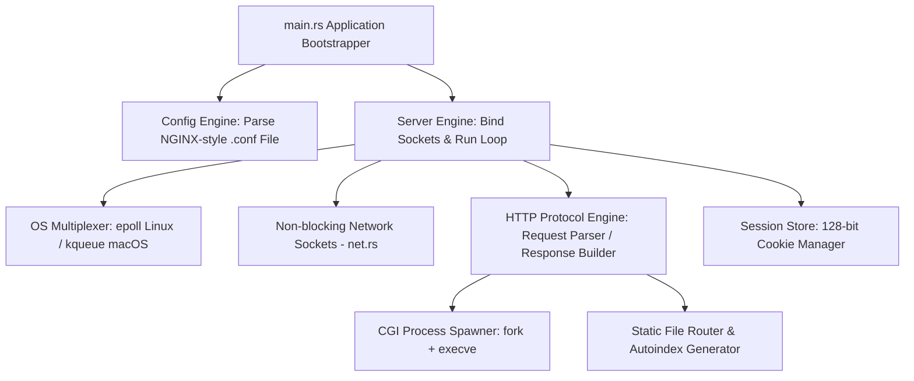
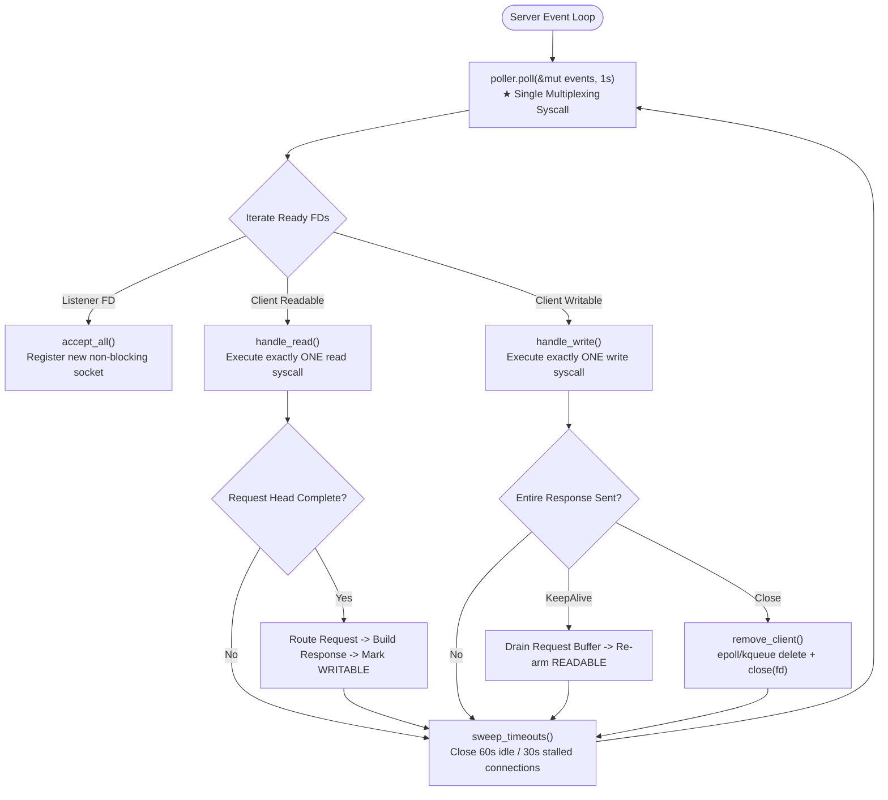

# ⚙️ ServOxide

[](https://www.rust-lang.org/)
[](#-system-architecture)
[](LICENSE.md)

**ServOxide** is a high-performance, single-process, non-blocking **HTTP/1.1 Web Server** written from scratch in Rust using only `libc` for system calls. Operating without external async runtimes (`tokio`), wrapper crates (`nix`), or web frameworks, ServOxide implements its socket multiplexing event loop, HTTP parser, NGINX-style configuration engine, CGI process spawner, and session cookie manager by hand.

---

## ⚡ Key Highlights

- **Single Event Loop Architecture**: Governed by exactly one multiplexing OS call per tick (`epoll` on Linux, `kqueue` on macOS) via level-triggered non-blocking sockets.
- **Pure `libc` Syscall Implementation**: Zero reliance on heavy async runtimes or third-party web frameworks.
- **NGINX-Style Config Engine**: Hand-written recursive-descent parser supporting virtual hosts, custom error pages, route prefixes, static assets, autoindexing, and redirects.
- **CGI Script Runner**: Process spawner (`fork` + `execve`) with pipe I/O, script directory change, environment mapping (`QUERY_STRING`, `CONTENT_LENGTH`), and 10-second timeout enforcement.
- **Stateful Cookie & Session Management**: 128-bit cryptographic session tracking, visit counting, and 30-minute idle TTL memory cleanup.

---

## 📋 Table of Contents

- [Key Highlights](#-key-highlights)
- [System Architecture](#-system-architecture)
- [Event Loop & Single-Thread State Machine](#-event-loop--single-thread-state-machine)
- [Request Flow Sequence](#-request-flow-sequence)
- [Configuration Reference](#-configuration-reference)
- [Setup & Execution](#-setup--execution)
- [Project Directory Structure](#-project-directory-structure)
- [License](#-license)

---

## 🏗️ System Architecture



---

## 📐 Event Loop & Single-Thread State Machine



---

## 📐 Request Flow Sequence

```mermaid
sequenceDiagram
    participant Client as Web Browser / HTTP Client
    participant Loop as ServOxide Event Loop
    participant HTTP as HTTP Parser & Router
    participant CGI as CGI Subprocess (Python)
    participant Session as Session Store

    Client->>Loop: TCP Connection Request
    Loop->>Loop: accept() -> Register Socket (READABLE)
    Client->>Loop: GET /cgi/test.py HTTP/1.1
    Loop->>HTTP: parse_request(buffer)
    HTTP-->>Loop: Request Struct (Headers, Virtual Host, Path)
    
    alt Static File Route
        HTTP->>HTTP: Read File from Root Directory
    else CGI Route (.py)
        HTTP->>CGI: fork() & execve(/usr/bin/python3, script)
        CGI-->>HTTP: Read Script STDOUT Output
    end
    
    HTTP->>Session: touch_session(cookie)
    Session-->>HTTP: Return Updated Visit Count & Set-Cookie
    HTTP-->>Loop: Response Struct (Status 200 OK, Body, Headers)
    Loop->>Client: Send HTTP Response (WRITABLE)
    Loop->>Loop: Connection: keep-alive -> Re-arm READABLE
```

---

## ⚙️ Configuration Reference

ServOxide reads NGINX-formatted `.conf` configuration files:

```nginx
server {
    host        127.0.0.1;
    port        8080;
    server_name localhost;

    client_max_body_size 10m;
    error_page  404 errors/404.html;

    route / {
        methods   GET;
        root      www;
        index     index.html;
        autoindex off;
    }

    route /uploads {
        methods   GET POST DELETE;
        root      www/uploads;
        autoindex on;
    }

    route /cgi {
        methods   GET POST;
        root      www/cgi;
        cgi       .py /usr/bin/python3;
    }
}
```

---

## 🚀 Setup & Execution

### Prerequisites

- **Rust**: Cargo and `rustc` (1.70+) installed.
- **POSIX Platform**: macOS (`kqueue`) or Linux (`epoll`).

---

### Build & Run

1. **Clone Repository**:
   ```bash
   git clone https://github.com/sahmedhusain/servoxide.git
   cd servoxide/lc
   ```

2. **Compile Release Binary**:
   ```bash
   cargo build --release
   ```

3. **Launch ServOxide**:
   ```bash
   ./target/release/servoxide config/default.conf
   ```
   *ServOxide will start listening at `http://127.0.0.1:8080/`.*

4. **Execute End-to-End Audit Suite**:
   ```bash
   ./tests/run_tests.sh
   ```

---

## 📂 Project Directory Structure

```
servoxide/
├── README.md               # Main documentation
├── LICENSE.md              # MIT License
├── GETTING_STARTED.md      # Setup, audit tests, and macOS/Linux instructions
└── lc/
    ├── Cargo.toml          # Rust package manifest (name: servoxide)
    ├── config/
    │   └── default.conf    # Server configuration file
    ├── src/
    │   ├── main.rs         # Bootstrapper & CLI parser
    │   ├── poll/           # epoll (Linux) and kqueue (macOS) multiplexing drivers
    │   ├── net.rs          # Non-blocking socket listener factory
    │   ├── config/         # NGINX-style configuration lexer & recursive parser
    │   ├── http/           # HTTP request parser, response builder, and router
    │   ├── server/         # Core event loop and client connection manager
    │   ├── cgi/            # CGI process spawner & pipe IO runner
    │   └── cookies/        # Session store and 128-bit token manager
    ├── www/                # Document root files & CGI scripts
    └── tests/              # End-to-end audit test scripts & fixtures
```

---

## 📄 License

Distributed under the MIT License. See [LICENSE](LICENSE.md) for details.
